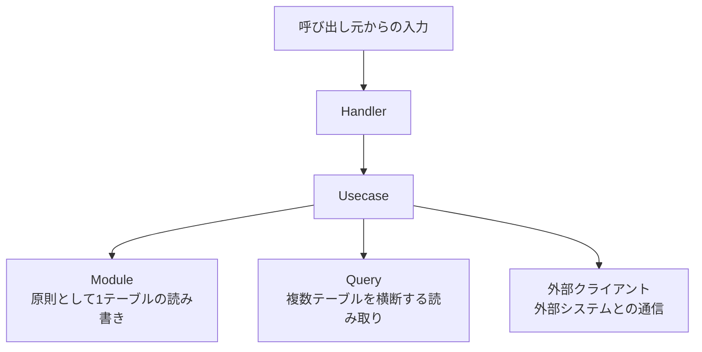

# HUMQの概要

HUMQは、RDBを中心とするアプリケーションのコードを4つの責務に分け、<br>
業務の複雑さをUsecaseから追跡できる状態に保つアーキテクチャです。

## HUMQを構成する責務

- **Handler**: HTTP、イベント、CLIなど、呼び出し元との入出力を扱う。
- **Usecase**: 業務フロー、条件分岐、状態変更、整合性、トランザクション境界を扱う。
- **Module**: 原則として1テーブルの読み書きを扱う。
- **Query**: 複数テーブルを横断する読み取りを扱う。書き込みは行わない。

外部クライアントはHUMQの層ではなく、<br>
メール、決済、外部APIなどとの通信を隠すアダプターです。

## 置き場所を決める4つの規則

| 処理 | 責務 |
| --- | --- |
| 呼び出し元との入出力 | Handler |
| 業務フローと処理の組み立て | Usecase |
| 原則として1テーブルの読み書き | Module |
| 複数テーブルを横断する読み取り | Query |

外部システムとの通信は外部クライアントに置き、Usecaseから呼び出します。<br>
意味や関連性を毎回解釈するのではなく、操作対象と処理の種類によって置き場所を決めます。

## 依存関係



HandlerはUsecaseだけを呼びます。<br>
Usecaseは必要なModule、Query、外部クライアントを明示的に組み合わせます。<br>
Module同士は呼び合わず、Queryは書き込みやトランザクション管理を行いません。

## 書き込みと読み取りの流れ

複数テーブルを更新する業務処理は、UsecaseがModuleを順番に呼び出します。

```text
ConfirmOrderUsecase
  InventoryModule.decrease()        -> inventories
  OrderModule.markConfirmed()       -> orders
  OutboxModule.enqueue()            -> outbox
```

どのテーブルをどの順序で更新し、どこまでを同じトランザクションで扱うかは、<br>
Usecaseから確認できます。各Moduleは対応する1テーブルだけを変更します。

複数テーブルを使う画面、検索、帳票などの読み取りは、UsecaseがQueryを呼び出します。

```text
ListAccountOrdersUsecase
  AccountOrdersQuery.fetch()
    accounts JOIN orders JOIN order_items
```

読み取り専用のUsecaseがQueryを呼ぶだけの場合も、HandlerからQueryを直接呼びません。<br>
Usecaseはアプリケーションが提供する操作、Queryはそのデータを読む方法を表します。

## 設計上の前提

- RDBのテーブルを、安定した主要な永続化境界として扱う。
- Moduleをテーブル構造へ意図的に結び付ける。
- 正規化されたテーブル構造が、複数のModule呼び出しとしてUsecaseに現れることを許容する。
- 業務が複雑になればUsecaseも肥大化するが、主要なフローは上から下へ追える状態に保つ。
- 複数テーブルの整合性を自動では保証せず、Usecase、DB制約、テストで明示的に守る。
- 永続化方式から独立したDomain Entityや、DTOへの変換を必須としない。
- DB接続、外部連携、監視など、アプリケーション全体のディレクトリ構成は規定しない。

詳しい配置規則は[層と責務のルール](02-layer-rules.ja.md)、<br>
判断に迷ったときの優先順位は[設計原則](03-design-principles.ja.md)、<br>
データ整合性の扱いは[整合性の扱い](04-consistency-and-transactions.ja.md)で説明します。

向いている場面とトレードオフは、<br>
[適用判断とトレードオフ](05-comparison.ja.md#適用判断とトレードオフ)を参照してください。

---

前へ: [README](../README.ja.md) | 次へ: [層と責務のルール](02-layer-rules.ja.md)
