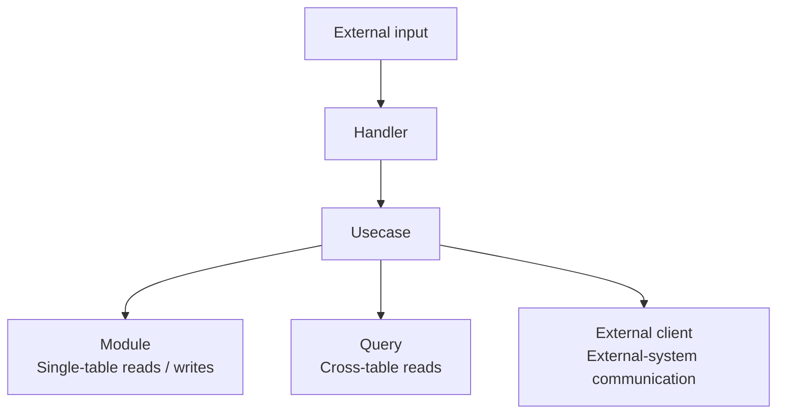

# HUMQ Overview

HUMQ divides code in RDB-centered applications into four responsibilities<br>
and keeps business complexity traceable from Usecase.

## HUMQ Responsibilities

- **Handler**: Handles external input and output through HTTP, events, CLI, and similar entry points.
- **Usecase**: Handles business flows, branches, state changes, consistency, and transaction boundaries.
- **Module**: Reads and writes exactly one table.
- **Query**: Reads across multiple tables and never writes.

An external client is not a HUMQ layer.<br>
It is an adapter that hides communication with email providers, payment gateways, external APIs, and similar systems.

## Four Placement Rules

| Operation | Responsibility |
| --- | --- |
| External I/O | Handler |
| Business flow composition | Usecase |
| One-table database access | Module |
| Cross-table reads | Query |

Communication with external systems belongs in external clients called by Usecase.<br>
Placement follows the operation target and type instead of a new interpretation of conceptual relatedness each time.

## Dependencies



Handler calls only Usecase.<br>
Usecase explicitly combines the Modules, Query code, and external clients it needs.<br>
Modules do not call each other, and Query neither writes nor manages transactions.

## Write and Read Flows

For a business operation that updates multiple tables, Usecase calls Modules in order.

```text
ConfirmOrderUsecase
  InventoryModule.decrease()        -> inventories
  OrderModule.markConfirmed()       -> orders
  OutboxModule.enqueue()            -> outbox
```

Usecase shows which tables are updated, in what order,<br>
and which operations share a transaction. Each Module changes only its corresponding table.

For lists, searches, and reports using multiple tables, Usecase calls Query.

```text
ListAccountOrdersUsecase
  AccountOrdersQuery.fetch()
    accounts JOIN orders JOIN order_items
```

Query returns data shaped for the screen or business context without changing state.

## Design Assumptions

- RDB tables are treated as stable, primary persistence boundaries.
- Module is intentionally coupled to table structure.
- As the business becomes complex, Usecase may grow, but its primary flow remains readable from top to bottom.
- Cross-table consistency is not guaranteed automatically; it is protected explicitly through Usecase, database constraints, and tests.

See [Layer Rules](02-layer-rules.md) for detailed placement rules,<br>
[Design Principles](03-design-principles.md) for priorities when judgment is required,<br>
and [Handling Consistency](04-consistency-and-transactions.md) for data consistency.

See [Adoption and Tradeoffs](05-comparison.md#adoption-and-tradeoffs)<br>
for suitable use cases and tradeoffs.

---

Previous: [README](../README.md) | Next: [Layer Rules](02-layer-rules.md)
