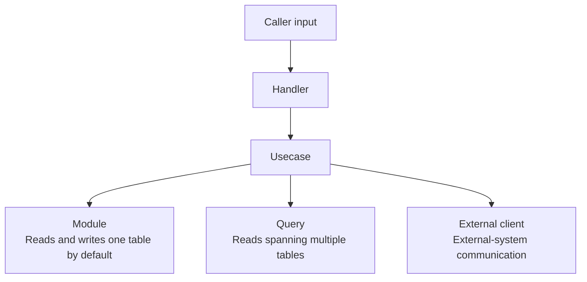

# HUMQ Overview

HUMQ divides code in RDB-centered applications into four responsibilities<br>
and keeps business complexity traceable from Usecase.

## HUMQ Responsibilities

- **Handler**: Handles input and output for callers through HTTP, events, CLI, and similar entry points.
- **Usecase**: Handles business flows, branches, state changes, consistency, and transaction boundaries.
- **Module**: By default, handles reads and writes for one table.
- **Query**: Handles reads spanning multiple tables and never writes.

An external client is not a HUMQ layer.<br>
It is an adapter that hides communication with email providers, payment gateways, external APIs, and similar systems.

## Four Placement Rules

| Concern | Responsibility |
| --- | --- |
| Caller input and output | Handler |
| Business flow composition | Usecase |
| Reads and writes for one table by default | Module |
| Reads spanning multiple tables | Query |

Communication with external systems belongs in external clients called by Usecase.<br>
Placement largely follows the operation target and type, reducing repeated judgments about conceptual relatedness.

## Dependencies


```mermaid
flowchart TD
    input["Caller input"] --> handler["Handler"]
    handler --> usecase["Usecase"]
    usecase --> module["Module<br>Reads and writes one table by default"]
    usecase --> query["Query<br>Reads spanning multiple tables"]
    usecase --> client["External client<br>External-system communication"]
```

Handler calls only Usecase.<br>
Usecase combines the Modules, Query code, and external clients needed for its primary flow.<br>
Business processing may stay in Usecase; extracting it into a named internal file is optional.<br>
If extracted, it handles details while remaining part of the Usecase responsibility.<br>
Modules do not call each other, and Query neither writes nor manages transactions.

## Write and Read Flows

For a business operation that updates multiple tables, Usecase calls Modules in order,<br>
directly or through named internal business processing.

```text
ConfirmOrderUsecase
  InventoryModule.decrease()        -> inventories
  OrderModule.markConfirmed()       -> orders
  OutboxModule.enqueue()            -> outbox
```

In this direct-call example, Usecase shows the updated tables, their order,<br>
and which operations share a transaction. With extracted processing, Usecase keeps the purpose<br>
and primary order visible, while its referenced file shows the change targets.<br>
Each Module changes only its corresponding table.

For screens, searches, and reports that read multiple tables, Usecase calls Query.

```text
ListAccountOrdersUsecase
  AccountOrdersQuery.fetch()
    accounts JOIN orders JOIN order_items
```

Even when a read-only Usecase only delegates to Query, Handler does not call Query directly.<br>
Usecase represents the operation the application provides; Query represents how its data is read.

## Design Assumptions

- RDB tables are treated as stable, primary persistence boundaries.
- Module is intentionally coupled to table structure.
- A normalized table structure may appear as multiple Module calls in Usecase or its named internal processing.
- As the business becomes complex, Usecase may grow or optionally delegate details to named internal processing, while its primary flow remains readable from top to bottom.
- Cross-table consistency is not guaranteed automatically; it is protected explicitly through Usecase, database constraints, and tests.
- Persistence-independent Domain Entities and conversion into DTOs are not required.
- The directory structure for database connections, external integrations, observability, and the rest of the application is not prescribed.

See [Layer Rules](02-layer-rules.md) for detailed placement rules,<br>
[Design Principles](03-design-principles.md) for priorities when judgment is required,<br>
and [Handling Consistency](04-consistency-and-transactions.md) for data consistency.

See [Adoption and Tradeoffs](05-comparison.md#adoption-and-tradeoffs)<br>
for suitable use cases and tradeoffs.

---

Previous: [README](../README.md) | Next: [Layer Rules](02-layer-rules.md)
